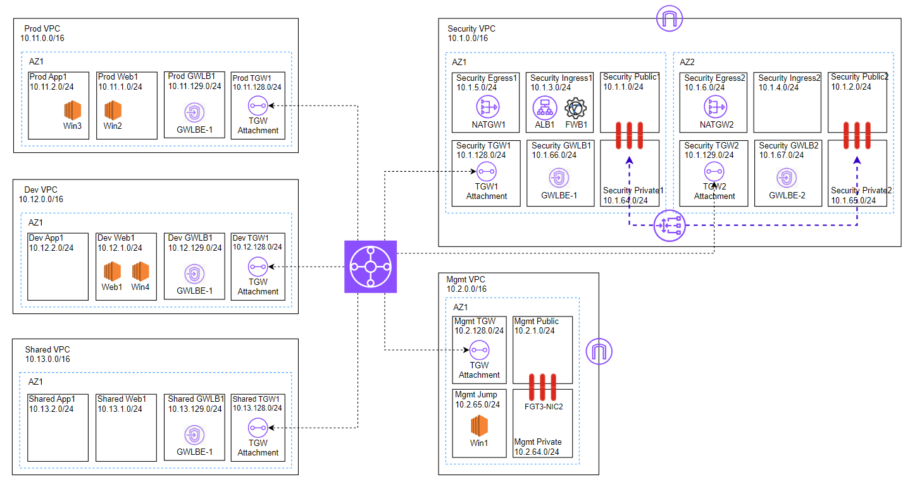
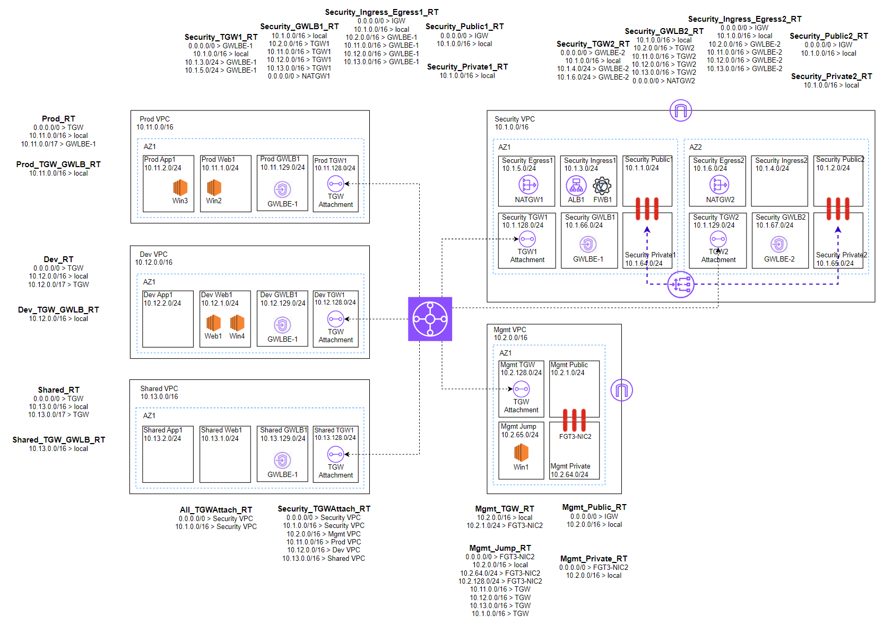

# Let's Deploy FortiGate HA on AWS using Transit Gateway and Gateway Load Balancer and multiple VPCs in just 30 minutes.  
This will guide how to deploy FortiGate HA on AWS using Transit Gateway and Gateway Load Balancer.  
In this guide, it is for 1-aws-user-account.  

## Objectives  
I have developed this project to help Fortinet's partners and customers to be able to easily deploy FortiGate HA on AWS using Transit Gateway and Gateway Load Balancer.  
Please feel free to use this guide to deploy in Demo, POC, and Production environment.  



In this deployment, you will not see ALB or FortiWeb. It is just the plan for next version of this project.  
If you need more features or other projects/deployment model, please feel free to contact me.  

## Configuration Files  
Please feel free to change configuration in the following files to match your requirements.  

### terraform.tfvars  
The most important file is terraform.tfvars . You have to enter AWS' access key and secret key into this file. Please <mark style="background-color: #FFFF00">DO NOT</mark>  upload this file back to your repository such as GitHub/GitLab/BitBucket.  

### locals.tf  
Please check architecture diagram above.
Match name inside the architecture diagram with each local variable in filename "locals.tf".  
You can many things such as :-  
- Region  
- AZ  
- Name of VPCs  
- Name of Subnets  
- IP Addresses  
- Name of Routing Tables  
- Name of Internet Gateway  
- Name of Elastic IPs  
- Name of NAT Gateway  
- Name of Transit Gateway  
- Name of Transit Gateway Attachments  
- Name of Gateway Load Balancer  
- Name of Gateway Load Balancer Endpoints  
- FortiGate's Admin Port  
- Name of Keypair  
- CPU type of FortiGate, this one is quite important. It will help cost saving and very good performance.  
- FortiGate EC2 instance type, if you want to upsize or downsize FortiGate to match your workload. You can configure this one.  
- FortiGate License Type (byol or payg), this one must be lower case.  

### license1.lic, license2.lic, license3.lic  
In case of PAYG, you don't have to configure these 3 files. You can leave them as empty files.  
In case of BYOL, you can change these 3 filenames to be your license filenames.  
In case of BYOL-FortiFlex, you don't have to configure these 3 files. You can leave them as empty files. After all FortiGate VMs starting, you have to change their default password, SSH to those FortiGate VMs, and then apply FortiFlex license keys by using this CLI command.  
```
exec  vm-license  <FortiFlex-License-Key>
```

If you got error while running this command, you might check that your are not in "Global" VDOM.  

### variables.tf  
You might see lots of FortiGate AMI in this file. They are based on FortiGate VM 7.4.1.  
If you got error because of these AMIs, you might see some AMIs in some regions might not be working. Please go to AWS EC2 to manual create FortiGate VM on your selected region, then, copy AMI from that screen and paste into this file.  

Example, I found that there are 2 "ap-northeast-1" which causing error when running "terraform apply". I found out that the x86-byol-AMI is not correct. Thus, I have changed from "ap-northeast-1" to be "ap-northeast-11" as shown below.

```
    ap-northeast-11 = {
      arm = {
        payg = "ami-0120da3994be18943"
        byol = "ami-0d68c6720c07a4209"
      },
      x86 = {
        payg = "ami-0a3aee9d7c6d3509e"
        byol = "ami-0bf160b007a77d3f9xx"
      }
    },
```

## Routing  
Routing is one of the most important topic. Please check routing tables in this picture below for more details.  



In case you might doubt about the [AWS Transit Gateway Propagation and Association](https://medium.com/@toobeetoob/aws-transit-gateway-propagation-and-association-16307d41e4a0), please check this artical for more detail.  

## Deploying to AWS  
Again, before deploying, please <mark style="background-color: #FFFF00">DO NOT</mark> upload access key and secret key to repository/GitHub/GitLab/Bitbucket.  

In case you don't have background on Terraform, please be noted that cost of using AWS will be started after running these commands.

Run these commands to start deploying to AWS.  
```
terraform init
terraform apply
```

## How to Access to New Environment  
After finish deploying using Terraform, you will see the followings in output.  

- Public IP addresses of all FortiGates  
- Username and Password  
- Private IP addresses of all testing machines (Windows, Linux)  

Please be noted the "Win1" is Jump Server into this environment. But you should be not be able to RDP to this EC2. You will have to manually create Firewall Policy in FortiGate VM FGT3.  

### Next steps  
At FGT3  
Create VIP for Win1.  
Create Firewall Policy for Win1.  
If you want Win1 to be able to access the Internet, you can create Address and Firewall Policy.  

RDP to Win1  
You should be able to RDP to Win2. If cannot, please check Firewall Policy of FGT1/2.  

At Win2  
You should be able to SSH to Web1.  
You should be able to RDP to Win3, Win4.  

## N-S Inspection  
Web1 is a Web Server.  
Traffic from Internet to Web1 will be inspected as N-S inspection (Ingress).  
If you cannot access from Internet to Web, it might because there isn't ALB1 or FortiWeb1 which are showing in diagram. But actually, there isn't. It is plan for next version of this guide. For now, you have to manually deploy AWS ALB or FortiWeb VM.  
Or, it might because of Firewall Policy of FGT1/2.  

Traffic from Win2/Win3/Win4/Web1 to Internet will be inspected as N-S inspection (Egress).  
If you cannot access from Win2/Win3/Win4/Web1 to Internet, it might because of Firewall Policy of FGT1/2.  

## E-W Inspection  
Traffic from Win2 to Win3/Win4/Web1 will be inspected as E-W inspection.  
You might check Firewall Policy of FGT1/2 for more details.  

## Other Next-Gen Firewall Features  
After finish deploying this environment, please feel free to enable next-gen firewall features.  
